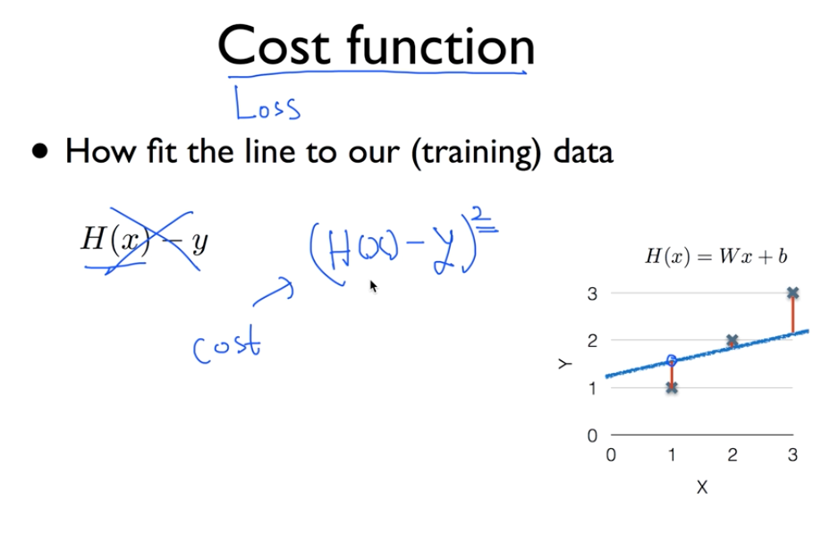
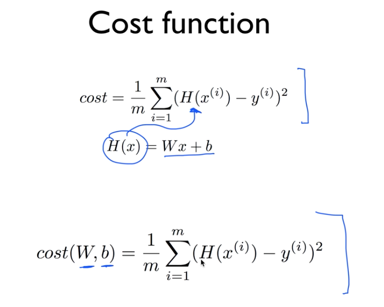

## Linear Regression

* Hypothesis

	test data set을 통해 가설을 세운다.

* Cost function(=Loss function)

	가설을 세운 한 직선에 대해 떨어져 잇는 거리 측정.
	
	실제 데이터와 얼마나 다른가 나타내는것.

(H(x)-y)^2 제곱을 하는이유는 음수와 양수의 값을 차별 하지 않고 같이 보기위해서 또 많이 떨어져 있을수록 값이 커지기 때문에 눈에 잘 들어옴.

m 은 test 개수 

W와 b를 구하는 것이 Linear Regression의 학습이다.

W와 b의 값은 작을 수록 좋다.
