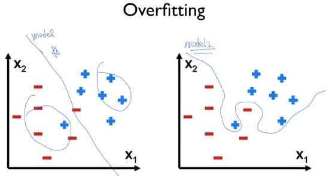
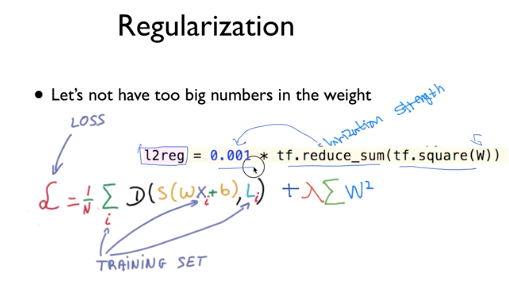

### Learning rate

* Overshooting 

**Learning rate 가 너무 클때**
cost 함수에서 cost가 줄어 들지 않고 바깥으로 튕겨나가거나 발산하는 것을 나타냄  
**Learning rate가 너무 작을때**
너무작아서 시간이 다되도 찾질못함. 

따라서 Learning rate를 출력하면서 잘 찾아야함.

Learning rate를 잘 찾았는데 
cost함수가 이상하거나 하면 

데이터가 큰차이가 있는지 찾기 또 Preprocessing 됐는지 확인

### Overfitting

너무 정확하면 안댕

**해결방안**

1. training data 많아야함.

2. features 중 중복되있는거 줄이는거 

3. Regularization

	weight를 적은 값을 가지게함. 그래프를 피게 만듬.
	cost함수에 **regularization Strength * W^2의 합 **
	
