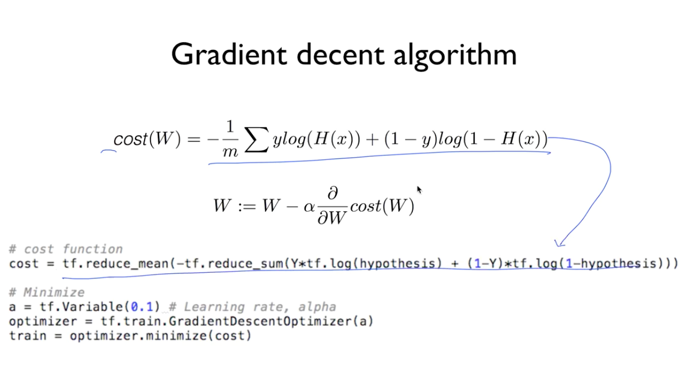

## Logistic Classification

#### Birary Classification

* Spam Detection : Spam or Ham
* Facebook feed : show or hide
* Credit Card Fraudulent Transaction detection : legitimate/fraud

#### logistic function, sigmoid function

sigmoid - S자 모양의 그래프라서

g(z) = 1 / ( 1 + e^-z )
 

이 함수를 이용해서 cost 함수를 만든다.

