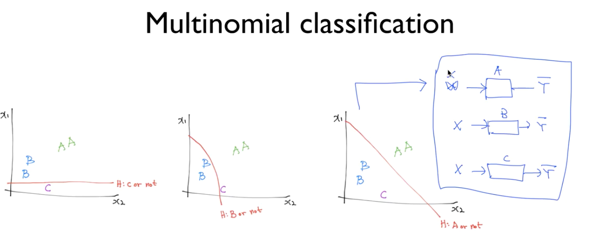
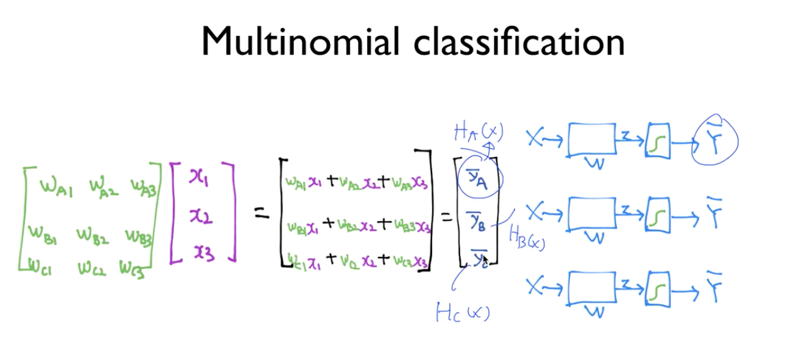
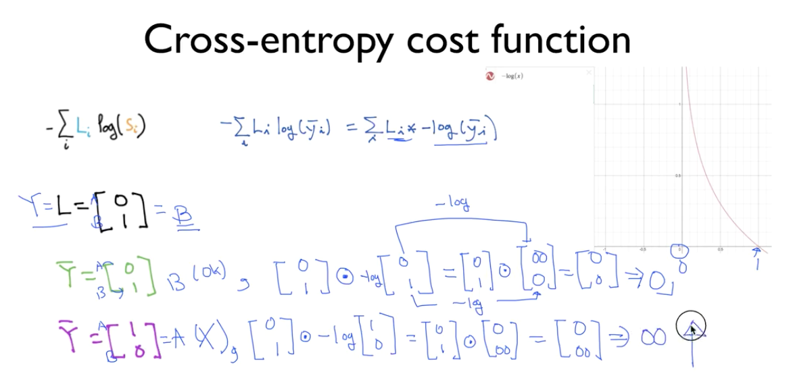

## Multinomial classification

여러개의 클래스를 가지고 있는것.

를 밑의 사진처럼 매트릭스로 가능함.

S => sigmoid 함수를 써서 0~1사이의 값으로 나타내길 원함. 이것을 해주는게 **softmax**

#### softmax

결과값인 y값을 softmax 처리하면 모든 값의 합이 1이 나오도록 조정함.

* cost function 

	값이 맞으면 작은값 틀리면 큰값
	

#### one-hot 인코딩

softmax 한 값을 1과 0으로만 나타내는것.

tensorflow에서 arg-max라는 함수가 주어져있음. 그대로쓰믄뎀

