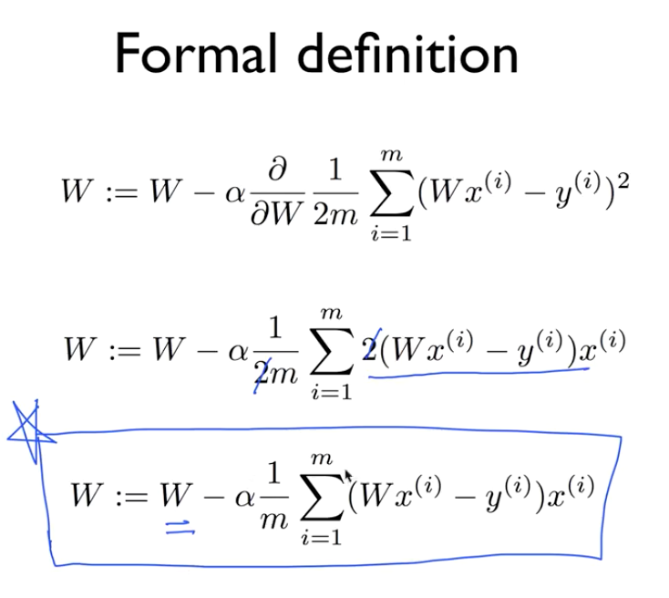
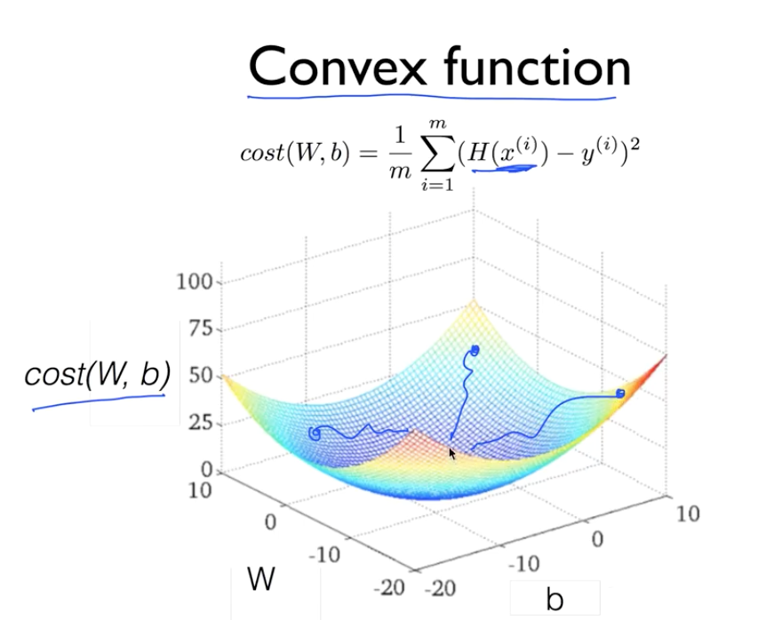

### cost 최소화 알고리즘

* Gradient descent algorithm ( 경사에 따라 내려가는 알고리즘 )

	cost를 최소화 하는데 사용됨 
	
	

cost function을 W에 대해 미분함 기울기를 따라 내려가려고

Linear Regression을 사용하려면 이 convex fuction 그래프가 나와야 좋음 

아니면 시작점에 따라 결과 값이 달라 알고리즘이 잘 동작하지 않음 
